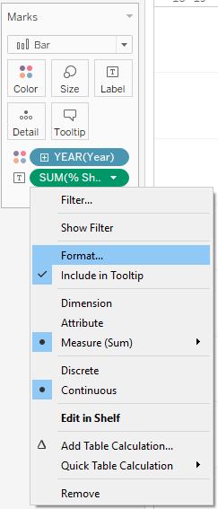

```{r setup, include=FALSE}
knitr::opts_chunk$set(echo = FALSE)
```
# The Original Visualisation


# Data Source

The original source of this chart can be found on page 22 of [Report: Labour Force in Singapore 2019](https://stats.mom.gov.sg/Pages/Labour-Force-In-Singapore-2019.aspx).   

The data is available at https://stats.mom.gov.sg/Pages/Labour-Force-Tables2019.aspx,  
Table 5: RESIDENT LABOUR FORCE PARTICIPATION RATE BY AGE AND SEX, 2009 - 2019 (JUNE).

# The Task

## a. Critic the graph from both its clarity and aesthetics. At least three from each evaluation criterion.    

### Clarity    

1. By using overlapping line charts for the two different years, it is able to show the increase or decrease for the various age group clearly. However, line graph is normally used to show trend over time, hence, it may be confuse the audience thinking that there is a relationship between the different age groups.
2. The chart title is stated as "Resident labour force by age" and sub-titled "Per Cent". There is no "%" symbol used for the whole chart. It is hard to visualise that chart is illustrating the percentage share of resident labour force by looking at the chart alone. 
3. The lead-in statement accompanying the data visualisation mentioned Labour Force Participation Rate (LFPR) a few times as a comparison to the percentage share of Resident Labour Force by Age Group, but there is no indication of LFPR within the visualisation. The visualisation is mainly describing the percentage share of the Labour Force by Age, and not LFPR.
4. The lead-in statement also mentioned age group that are not seen within the visualisation such as age group 25-54 and age group 55 & over.


### Aesthetics    
1. Good use of 2 contrasting colours (Dark Blue and Grey) to differentiate the two different years and using the brighter colour as a highlight for the later year (i.e. 2019).
2. The given month (June) for the label/legend for the data table is insignificant and distracting.
3. Putting the data label in the data table at the bottom of the chart is hard to relate the data to the chart.

    

## b. With reference to the critics above, suggest alternative graphical presentation to improve the current design. The proposed alternative data visualisation must be in static form. Sketch out the proposed design. Support your design by describing the advantages or which part of the issue(s) your alternative design try to overcome.


### Clarity

1. The initial line graph is changed to a side-by-side bar chart to make it clearer that there is no time-series trend portrayed in the visualisation.
2. The chart is clearly labeled as "% share of Resident Labour Force" so that the audience would be clear it is a percentage and not a number.
3. Additional chart is added to show how LFPR has changed for the different age groups from 2009 to 2019. It is also strategically placed on top of the revised side-by-side bar chart to align the x-axis (Age Group) for better comparison. A dumbbell chart is used to better portray the magnitude of the changes in each of the age group from 2009 to 2019.
4. Two additional charts are created with a more aggregated age group which were mentioned in the lead-in statement and also available in the dataset (i.e. 15-24, 25-64, 65 & Over). Both are an aggregated version of the side-by-side bar chart and dumbbell chart, and are strategically places on the right of respectively graph for better comparison.


### Aesthetics
1. Both dark blue and grey colours are retained and used in all 4 charts. An additional golden yellow colour is used for the dumbbell chart to better highlight the changes of the LFPR between 2009 and 2019.
2. Remove all unnecessary legend and focus on using colours to differentiate the two different years. A legend is added to the top right.
3. The data table is removed and data labels are added to all points. This allows users to view each data point in static form.

## c. Using Tableau, design the proposed data visualization.   

[Link to Proposed Data Visualisation in Tableau Public](https://public.tableau.com/profile/lance.teo#!/vizhome/DataVizMakeover01/HowdoesSingaporeResidentLabourForcechangedfrom2009to2019)

## d. Provide step-by-step description on how the data visualization was prepared.

### Data Preparation

2 datasets were used for this data visualisation:   

* [(5) Resident Labour Force Participation Rate by Age and Sex, 2009 - 2019 (June)](https://stats.mom.gov.sg/iMAS_Tables1/LabourForce/LabourForce_2019/mrsd_2019LabourForce_T5.xlsx)
* [(7) Resident Labour Force Aged Fifteen Years and Over by Age and Sex, 2009 - 2019 (June)](https://stats.mom.gov.sg/iMAS_Tables1/LabourForce/LabourForce_2019/mrsd_2019LabourForce_T7.xlsx)

Screenshots of the raw dataset are as shown below:


However, we do not need many of the data and there are also some data that we need but not available in the dataset.
Therefore, a transformation is done to extract the data that we need for the data visualisation.

The data transformation steps (done in Microsoft Excel) are as follows:   

* For both tables, removed data for year 2010 to 2018
* For Table 7, compute the **% Share of Resident Labour Force** by taking the resident labour force of each age group divided by the total resident labour force for both years (2009 and 2019). *e.g. for age group 15 - 19 in year 2009, we take 31.8 divide by 1985.7 which gives us 0.016 or 16%.*
* For Table 5, the LFPR data were given in percentage instead of a decimal (e.g. 88% instead of 0.88). A decimal is preferred for data visualisation in Tableau so we transformed the percentage into decimal by dividing the given data by 100. *e.g. 88 divide 100 gives us 0.88*.
* Next for both table, the data were manually pivoted by year and age group.
* Lastly, both tables are manually merged into one table.

The transformed dataset is shown below:    

{width=50% }   
As you may have noticed, there are some null values in the **% Share of Resident Labour Force** column. There is no problem here since we are not using these data points so we will leave it as null.

Lastly, we loaded this dataset into Tableau. 

Some steps that we took after loading the dataset:    

* Change the connection type (located at the top right) from *Live* to *Extract* since it was noted that Tableau Public does not work very well with live local dataset.


* Changed data type of **Year** column from *Number (whole)* to *Date*
    

And we are all set for the real work!

### Side-by-side Bar Chart

Below are the steps for our side-by-side bar chart:   

1. Drag **Age Group** and **Year** from Dimensions to *Columns* and **% Share of Resident Labour Force** from Measures to *Rows*.   

  

2. Drag **Age Group** to *Filters* and select the age groups that we want.   
i.e. 15-24, 25-29, 30-34, 35-39, 40-44, 45-49, 50-54, 55-59, 60-64, 65-69, 70 & Over    

  

3. Under *Marks*, change the chart type to **Bar** and drag **Year** to *Color*.    
{width=50% }     
4. Click on *Color* and click on *Edit Colors*. Change colours of year **2009** and **2019** to **#adadad** and **#0000d3** respectively under the **HTML** on the bottom right.   
  
5. Right click on the **X-Axis** and untick **Show Header**.
  
6. Right click on the **Y-Axis** and click on **Edit Axis**.
{width=50% }     

7. Change the **Range** to **Fixed** and change the *Fixed end** to **1**.
  

8. Right click on the **Y-Axis** again and untick **Show Header**.    
{width=50% }     

9. Drag **% Share of Resident Labour Force** to **Label** under **Marks**.    
{width=50% }     

10. Click on the **Down Arrow** that appears when you hover over the added label and click on **Format**.   
{width=50% }     
11. Under **Default** >> **Numbers**, choose **Percentage** and select **2 decimal places**.    
  

12. Rename current sheet to **% Share of Resident Labour Force (2009 vs 2019)**.    
   

13. To remove the grid lines, first right click on the chart and click **Format**.    
   

14. Click on the **Border** icon and select **Rows**. Under **Grid Lines**, select **None**.
{width=50% }     

15. And you got your 1st completed side-by-side bar chart for all age groups.   
  

16. To create the 2nd side-by-side bar chart for aggregated age groups (15-24, 25-64, and 65 & Over), right click the current sheet at the bottom of the screen and click **Duplicate**.    
{width=50% }     

17. Navigate to the duplicated sheet and select the columns that want to group together (e.g. 15-19 and 20-24), right click, and select **Group**.   
{width=50% }     

18. Right click on the grouped column and click on **Edit Alias**.    
{width=50% }     

19. Rename the group accordingly e.g. in this case **15 - 24**. Repeat step 17-19 for the rest of the age groups **i.e. 25-64 and 65 & Over**   
  

20. Rename the new sheet to **% Share of Resident Labour Force (2009 vs 2019) - Aggregated**.   
  

21. And you got your 2nd side-by-side bar chart for the aggregated age groups.    
     

### Dumbbell Chart    

Below are the steps for dumbbell chart:   

1. Drag **Age Group** from Dimensions to *Columns* and **LFPR** from Measures to *Rows* **2 times**. Right click on one of the **LFPR** and select **Dual Axis**.       

    

2. Drag **Age Group** to *Filters* and select the age groups that we want.   
i.e. 15-24, 25-29, 30-34, 35-39, 40-44, 45-49, 50-54, 55-59, 60-64, 65-69, 70 & Over    

    

3. Right click on the **Y-Axis** and select **Format**. Click on **Numbers** and change to **Percentage** at **1 decimal place**.   
    

4. Under **Marks**, go to the first **SUM(LFPR)**.    
Change the chart type to **Line**.    
Click on **Size** and adjust to approximately **95%** of the slider.   
Drag **Year** from **Dimension** to the **Line** icon and drag **LFPR** from **Measure** to the **Label** icon.
{width=50% }   

5. Click on **Color** and select the *Yellow* that was selected in the screenshot below. Adjust the **Opacity** to **58%**.   
{width=50% }    

6. Navigate to second **SUM(LFPR)** under **Mark** and change the chart type to **Circle**.   
Drag **Year** from **Dimension** to **Color**.    
{width=50% }   

7. Right click on the **Y-Axis** and select **Synchronize Axis**.   
{width=50% }   

8. And then right click on the **Y-Axis** again and untick **Show Header**.   
{width=50% }   

9. To make clearer for the audience, we have to add horizontal lines to differentiate the age groups.   
Right click the chart and select **Format**.    
    

10. Select the **Border** icon and go to **Columns** tab. Click on **Grid Lines** and select the **Solid Line**. Choose **Dark Grey** colour as well.   
    

11. And we got our first dumbbell chart for all age groups.   
    

12. To create the second dumbbell chart, right click the current sheet and click **Duplicate**.   
{width=50%}   

13. The aggregated age groups for **LFPR** are already available in the dataset so we just need to click on the **Age Group** filter and select **Edit Filter**.    
{width=50%}   

14. Select the following three age groups: **15-24, 25-64, 65 & Over**.   
    

15. Go to the **Circle** chart under **Mark** and adjust the **Size** accordingly. In this case, the slider is at approximately **5%** mark.    
    

16. And you got your second dumbbell chart for the aggregated age groups!   
    


### Dashboard & Final Data Visualisation

For the dashboard, we inserted a more explanatory title **"How does Singapore Resident Labour Force changed from 2009 to 2019"** at the top and a clearer lead-in statement stating the overall finding of the visualisation which is that the **Singapore Resident Labour Force has gotten OLDER from 2009 to 2019**.        

The charts are also strategically placed such that the axes of all 4 charts are aligned and comparable to one another, as seen in the screenshot below.        

A legend is also added at the top right corner which is universally used by all 4 charts.

     

## e. Describe three major observations revealed by the data visualisation prepared.    
1. The resident labour force has gotten older with more and more elderly/potential retirees (aged 65 & above) remaining in the workforce. Labour force aged 65 and above has % share of resident labour force of 7.12% in 2019, up from 3.02% in 2009.The LPFR for the same age group has increased more than 10% from 2009 to 2019.
2. There is a noticeable increasing trend in the % share of resident labour force for resident labour aged 55 and above while the opposite is observed for resident labour aged below 55. This is a potential indication of an aging population.
3. LFPR for age group 65-69 has the highest increase of 16.2% from 2009 to 2019. This could means that there is better recognition of our older and more experienced resident labour by their company and more of them are being re-employed after reaching retirement age of 62.


