```{r setup, include=FALSE}
knitr::opts_chunk$set(echo = FALSE)
```

# Original Visualisation   


# Data Source

The data used by the research team was obtained from [Imperial College London YouGov Covid 19 Behaviour Tracker Data Hub](https://github.com/YouGov-Data/covid-19-tracker) hosted at Github. The research mainly utilised survey conducted on January 2021. The field vac-1: If a Covid-19 vaccine were made available to me this week, I would definitely get it: of the survey is used to prepare the data visualisation.

# The Task

## a. Critic the data visualisation from both its clarity and aesthetics. At least three from each evaluation criterion.

### Clarity

1. There is **no indication of how many respondents** are there for each country so it might be mislead the reader thinking that the number of respondents of each country are the same.
2. Since both of the original visualisations are bar charts (stacked and horizontal respectively), having **different X-axis scale** might mislead readers. The horizontal chart for "Strongly Agree" on the right with X-axis range from 0% to 60% looks much longer than the stacked bar chart on the left with x-axis range from 0% to 100% even though they should be of the same size.
3. The legend indicated **"Vac 1"** which is the alias for the survey question "If a Covid-19 vaccine were made available to me this week, I would definitely get it.", but there is no mention of it anywhere. This might confuse readers on the meaning of "Vac 1".
4. The stacked bar chart on the left is **not easy to quickly see the proportions of disagree, agree, and neutral** as there is no central guide to guide the readers.
5. The horizontal bar chart on the right **did not take into considerations of uncertainty.**

### Aesthetics

1. There is **no specific meaning to the colour scheme** chosen and might confuse readers. For example, red is usually used for negative connotation and green is usually used for positive connotation, which should be used for disagree and agree respectively. However, red is used for neutral and green is used for "disagree" which is of a negative connotation.
2. **Wrong spelling of "Vaccine"** in the left chart title.
3. **The legend was not labeled clearly and fully** as only 1 and 5 are shown as "Strongly Agree" and "Strongly Disagree" respectively. 2, 3, and 4 were not labeled and were left to readers to derive. 
4. **The sorting order of the legend also differs from the actually presented order** of the data in the visualisation. The order in the visualisation starts from strongly disagree on the left to strongly agree on the right, while the legend sorted in the opposite way from top to down. This is harder for the readers to compare and reference.

## b. With reference to the critics above, suggest alternative graphical presentation to improve the current design. Sketch out the proposed design. The proposed alternative design should include interactive techniques. Support your design by describing the advantages or which part of the issue(s) your alternative design try to overcome.

### Proposed Visualisation


### Clarity

1. Add **a tooltip** to indicate the number of responses for each selected elements of the graph, and add a dynamic title to show total number of respondents.
2. Since we are **changing the horizontal bar chart to a scatter plot with confidence interval**, there is no need to sync the x-axis range as there is no similar element (bars) to compare, and thus, no confusion.
3. The proposed visualisation will be able to **dynamically change the survey question** and display the full question, rather than the alias e.g. Vac 1, in a dynamic title. This will make sure the readers know what is the actual context for the visualisation.
4. **A diverging stacked bar with neutral response being centralised** is used. This chart allows readers to quickly see the proportion of agree and disagree in a glance.
5. **Uncertainty line** is added to the proposed scatter chart to indicate the standard of errors at selected confidence interval.


### Aesthetics

1. **Red is used to indicate negative connotation** (i.e. strongly disagree and disagree with the prior of a darker shade) and **green is used to indicate positive connotation** (i.e. strongly agree and agree with the prior of a darker shade.). Grey which is a neutral colour by nature is used for the "neutral" response.
2. Correct the spelling, if required.
3. The number 1 to 5 are taken out of the legend and **replaced with the actual meaning.** i.e. strongly agree, agree, neutral, disagree, and strongly disagree.
4. The legend will be **sorted according to the order in the visualisation**, from strongly agree to strongly disagree, so that it is easier for readers to reference.

## c. Using Tableau, design the proposed data visualisation.


## d. Provide step-by-step description on how the data visualisation was prepared.

### Data Preparation

1. We are provided with data sets from 29 countries. For the purpose of this makeover, we are using only the same data sets from the same 14 countries used i.e. Australia, Canada, Denmark, Finland, France, Germany, Italy, Japan, Netherlands, Norway, Singapore, South Korea, Sweden, and United Kingdom.

2. The data provided also contains many more columns or fields that we need. Tableau Public might takes too long to load if the dataset is too big so we will trim the data down to those that we need. All the data cleaning is done via Excel.   

    

We are only extracting the following fields:

  * RecordNo	
  * endtime	
  * household_children	
  * age	
  * gender	
  * household_size	
  * employment_status (4 data sets have 7 of these columns - take all of them)
  * vac_1	
  * vac2_1	
  * vac2_2	
  * vac2_3	
  * vac2_6	
  * vac_3

    

3. As mentioned in *Step 2*, there are 4 data sets with employment_status "unpivoted" with the answer in different columns and boolean value (1 or 0).    

The 4 data sets are:

* Denmark
* Finland
* Norway
* Sweden

    

An Excel formula is used to combine the 7 columns into 1 column and mapped into the proper employment status using another formula as shown.

     
Reference Sheet for mapping.    
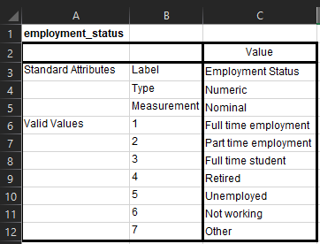{width=50%}  

4. Once the data sets are cleaned, we will import the data set into Tableau.

5. Select the following columns and click pivot.

  * vac_1	
  * vac2_1	
  * vac2_2	
  * vac2_3	
  * vac2_6	
  * vac_3

6. Rename the Pivot Column and Pivot Value to Questions and Score_raw respectively.

7. Remove the initial data set from the board and double-click on *Union*. Select *Manual Union* and drag in all the data sets.

8. Go to the last column called Table. Rename the column to Country and create alias as follows.

9. Data is now prepped for visualisation.

### Creating the Diverging Stacked Bar Chart

1. Create a calculated field called "Score" with the following formula.

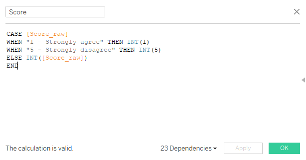

2. Create calculated field called "Answer" with the following formula.

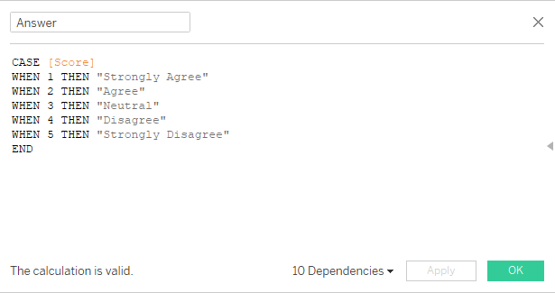
3. Click on the menu button of the Answer field and click Sort. Sort Answer by Score.

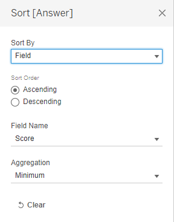{width=50%}  

4. Create a calculated field called Negative Scores with the following formula.

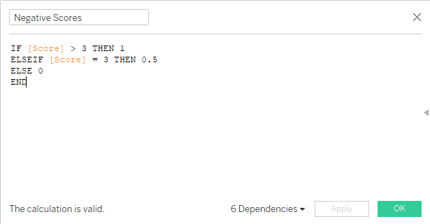

5. Create a calculated field called Total Negative Scores with the following formula and click on Default Table Calculation. Compute using Answer.


6. Create a calculated field called Total Scores with the following formula and click on Default Table Calculation. Compute using Answer.


7. Create a calculated field called Gantt Start using the following formula.

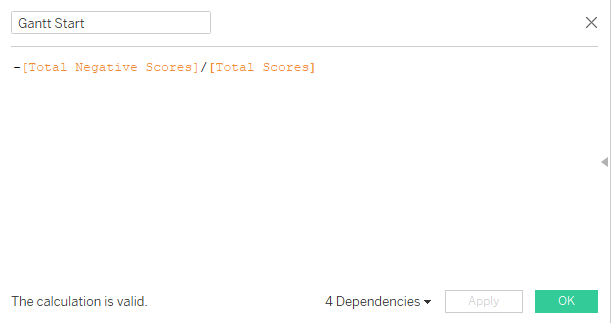

8. Create a calculated field called Percent of Total Sizing using the following formula.

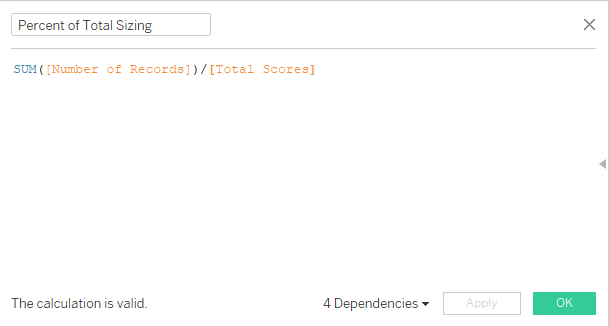

9. Create a calculated field called Gantt Percent using the following formula and click on Default Table Calculation. Compute using Answer.

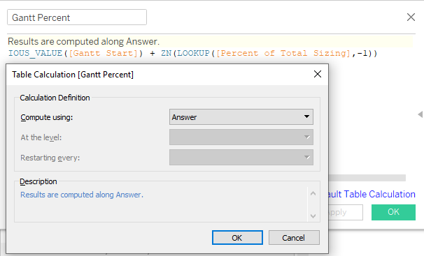

10. Drag Gantt Percent to Columns and Country to Rows.

{width=50%} 

11. Go to Marks and drag Answer to Color, Percent of Total Sizing to Size, and Number of Records to Detail as shown below. Change chart type from Automatic to Gantt Bar.

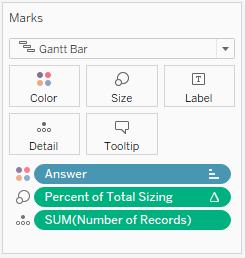{width=50% }  

12. Click on the legend on the top right and click Sort. Sort Answer by Field Score (Minimum) in Descending Order.

{width=50% }  

13. Right click on the Null value in the Legend and click Exclude.

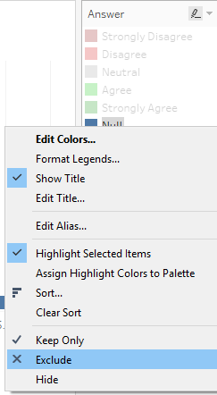{width=50% }  

14. Under Marks, click on Color > Edit Colors... and choose appropriate colours for each answer as shown below.   

* Strongly Disagree - Dark Red
* Disagree - Red
* Neutral - Light Grey
* Agree - Green
* Strongly Agree - Dark Green

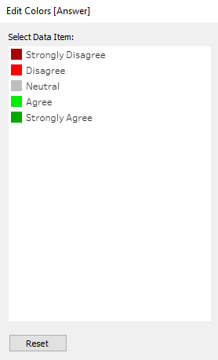{width=50% }  
15. Right-click on the X-axis and click Edit Axis... Change to Fixed and change Fixed Start to -1 and Fixed End to 1.

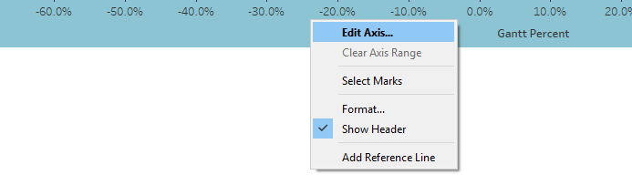
{width=50%} 

16. Right-click on the X-axis and click Add reference line. Select Constant and change value to 0. Change the line to a dashed line and select dark grey colour.

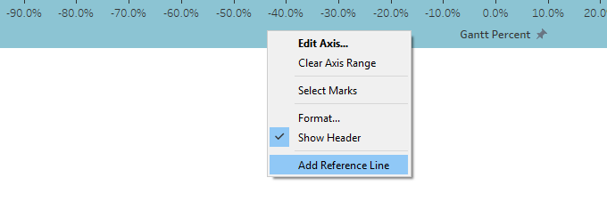
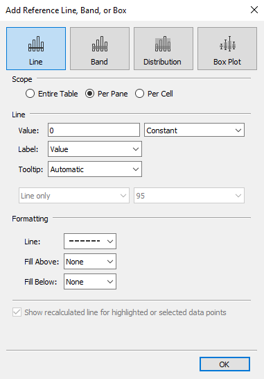{width=50% }  
17. Double-click on the Title and change title to Opinions to Selected Question.


18. In preparation to the dynamic dashboard later, add the following fields to Filters.   

* Questions
* gender
* employment_status
* age
* endtime
* household_size
* household_children

{width=50% }  

19. Right-click on each of the filters and Apply to Worksheets > All Using This Data Source.

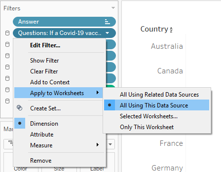
20. Add Number of Records to Details. Double-click on Tooltip and enter the following.

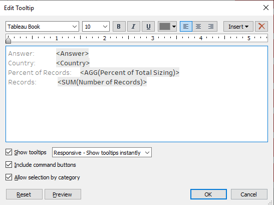

21. And the first visualisation: Diverging Stacked Bar Chart is done.


### Creating the Scatter Plot with Standard Error Line

1. Create a calculated field called "Score 1" using the formula below.

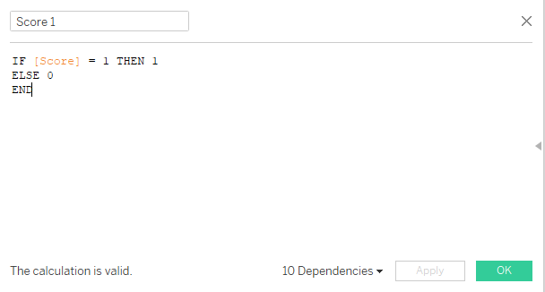

2. Create a calculated field called "% Score 1" using the formula below.

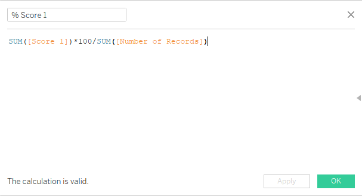

3. Create a calculated field called "Prop" using the formula below.


4. Right-click on Dimension and click Create Parameter. Call it Confidence Interval and add in all the different Confidence Intervals with their respective Z score. Following the settings as follow. Right-click the Confidence Interval parameter and click Show Parameter Control.

{width=50%} 


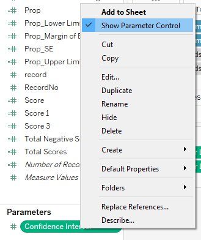{width=50%} 

5. Create a calculated field called "Prop SE" using the formula below.


6. Create a calculated field called "Prop_Margin of Error" using the formula below.

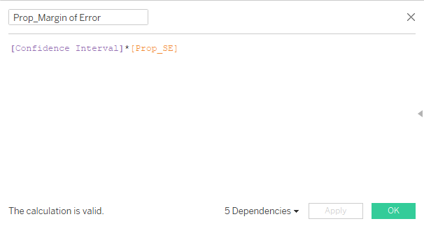

7. Create a calculated field called "Prop_Lower Limit" using the formula below.

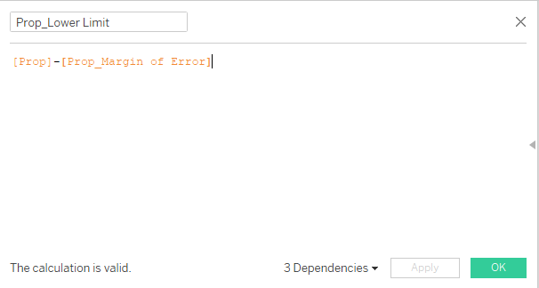

8. Create a calculated field called "Prop_Upper Limit" using the formula below.

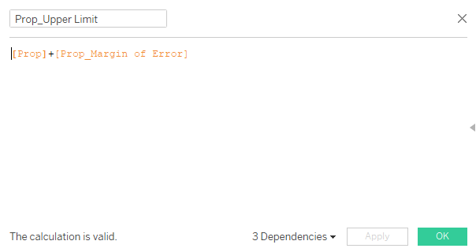

9. Drag Measure Values to Columns and Country to Rows.

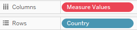{width=50%} 

10. Remove all from Measure Values except "Prop_Upper Limit" and "Prop_Lower Limit" as shown.

{width=50%} 

11. Go to Marks, Change Chart Type to Line, and Crtl+Drag Measure Names to Color, Details and Path.

{width=50%} 

12. Drag Prop to Columns to the right of Measure Values. Right-click in it > Select Dual Axis > Select Synchronize Axis.

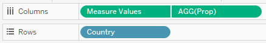

13. Right-click on Country and Sort. Sort by Prop in Descending Order.

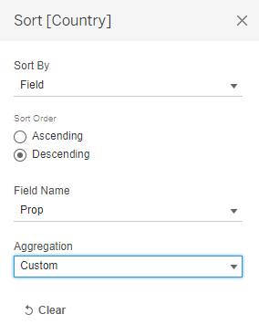{width=50%} 

14. Adjust the size of the line and circle accordingly.

15. Change colours of Prop, Prop_Lower Limit, and Prop_Upper Limit to Dark Green (Colour of Strongly Agree). Change Colour Opacity of Prop_Lower Limit and Prop_Upper Limit to 24%.

{width=50%} 

16. Right-click on the X-axis at the top and uncheck Show Header.

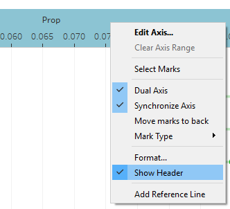{width=50%} 

17. Go to Analysis > Totals > Show Column Grand Totals > Column Grand Totals to Top.

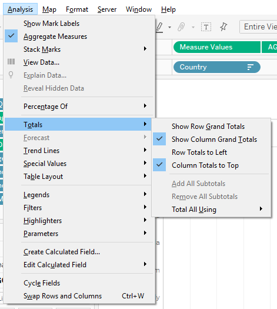

18. Right click on X-axis > Format > Change to Percentage (1 decimal point).

{width=50%} 

19. Double-click on Title and change to the following.


20. Go to Marks > AGG(Prop) > Change to Circle type chart > Drag AGG(Prop) to Label.

{width=50%} 

21. And the second visualisation: Scatter Plot with Standard Error Line is done.


### Dynamic Title

1. Create a New Worksheet. Go to Marks and drag Questions, Score 1, Number of Records, and Prop into Detail. Change chart type to Polygon.

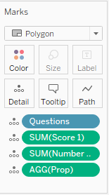{width=50%} 

2. Double-click on the title and change to the following.

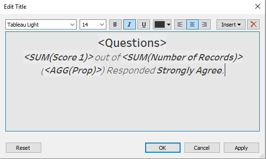

3. Right-click on AGG(Prop) > Format > Change to Percentage (1 decimal point).

{width=50%} 
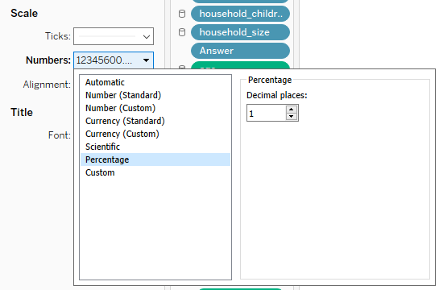

4. And you have a dynamic title for the dashboard later.


### Creating the Dashboard

1. Create a New Dashboard. Drag both visualisations created onto the dashboard. Diverging Stacked Bar Chart on the left and Scatter Plot with Standard Error Line on the right, as shown below.


2. Right-click on the Diverging Stacked Bar Chart > Filter > Select all the filters that we have prepared earlier as shown below.

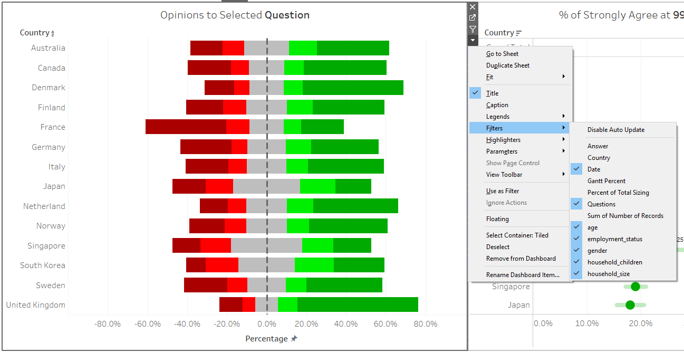

3. Format the Filter according to your preference and line them neatly on top of the 2 visualisations. Drag the dynamic title created earlier below the filters.

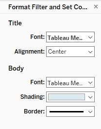{width=50%} 

  

4. Double-click on the Dashboard Title and format it to your preference, or follow the format below.

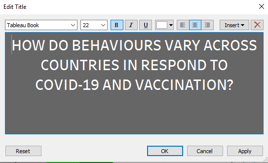

5. And the dashboard is done.


## e. Describe three major observations revealed by the data visualisation prepared.

1. **Many are probably worried about potential side effects of vaccine** that are created in about 1 short years (vaccine usually takes many more years to create) and are waiting for at least a year later before they can fully accept the vaccine.

This can be seen in the huge increase in the proportion of those who agree or strongly agree to the question "If a Covid-19 vaccine were made available to me a year from now, I definitely intend to get it" from that of the question "If a Covid-19 vaccine were made available to me this week, I would definitely get it.".

The responses to the question "I am worried about the potential side effects of a COVID-19 vaccine." are also steering more towards the Agree and Strongly Agree side, which confirmed our observation above.

Animated Transition - Vaccine made within a week versus a year.   

  
Responses for Question    
"If a Covid-19 vaccine were made available to me a year from now, I definitely intend to get it".
   
  
Responses for Question    
"If a Covid-19 vaccine were made available to me this week, I would definitely get it.".   


2. The responses from the above questions also give us insights on which are the countries that are most open to Covid-19 vaccination at the moment. The result consistently rank **(1) United Kingdom and (2) Denmark as the top countries who has the highest proportion of Strongly Agree for Covid-19 vaccination-related questions**.

Which is also not surprising that they are the countries least worried about the potential side effects of Covid-19 vaccination.

Responses for Question    
"If a Covid-19 vaccine were made available to me a year from now, I definitely intend to get it".  


Responses for Question    
"If a Covid-19 vaccine were made available to me this week, I would definitely get it.".   

Responses for Question    
"If I do not get a Covid-19 vaccine when it is available, I will regret it.".   
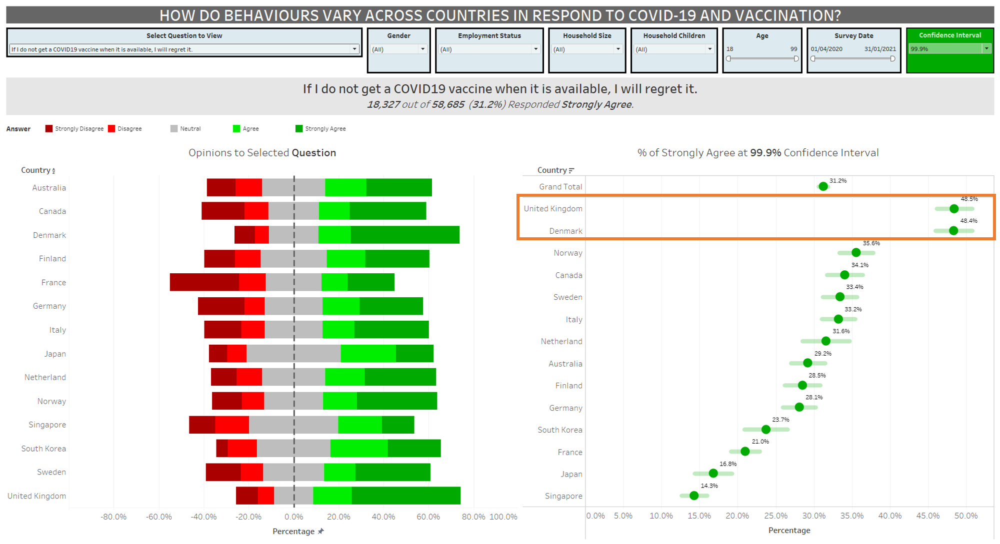

3. **The older you are, the more open you are to Covid-19 vaccination and would not mind getting the vaccination if made available within a week.**
The tipping point is at around age 40. This could be due to the heavier responsibilities that come with age especially around age 40 when people probably got married with kids and further down, being a grandparent and wanting to see your grandchildren grows up.

Animated Transition - Vaccine made available in a week against Age


