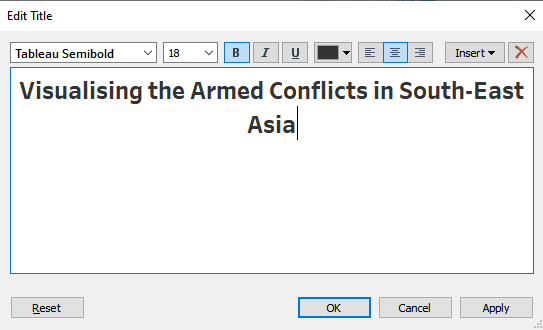

```{r setup, include=FALSE}
knitr::opts_chunk$set(echo = FALSE)
```

# Original Visualisation


# Data Source

The dataset used is extracted from [ACLED Data Export Tool](https://acleddata.com/data-export-tool/). An account is required to download the required data. Please follow the instructions via [ACLED Access Portal](https://developer.acleddata.com/).

This visualisation is only using data from Southeast Asia.

# The Tasks

## a. Critic the Data Visualisation

### Clarity

1. In the map plot on the left, many of the less occurred events were being "buried" under the more frequent events. For example, in the screen shot below, the "Battles" event type were covering the rest of the events. This will make readers thought that there are only "Battles" events occurring in that area.

{width=50%}  

2. Though the original visualisation, the map plot shows how many events are there and at which location has the event happened, it did not show how severe is each event.

3. The tooltip does serve any purpose by showing only the Event Id Cnty, Event Type, Longtitude, and Latitude. The plot on the map already clearly shows where did the event happened and what is the event type via the colour of the plot.

{width=50%}  

4. The map plot shows all the events for 6 years (2015-2020) which makes it quite hard to visualise the location of the events year by year and compare to the line plot on the right.

5. Title of the Y-axis for all the line graphs on the right are labeled "Count of Sheet 1" which has no meaning to the reader.(Highlighted in Yellow)

6. Title of the X-axis for of the line graphs on the right are labeled "Event Date" which should be "Year" instead, since only the aggregated data by year is shown.(Highlighted in Green)

7. The scale of the Y-axis for the line graphs are all different which makes it hard for reader to compare the magnitude between the event types.(Highlighted in Blue)

{width=50%}  

### Aesthetics

1. The order of the line graphs (from top down) has a different order from the legend which is arranged in ascending order alphabetically. (Highlighted in Pink)

2. There is no vertical line to direct readers to the year on the X-axis. (Dotted in Orange)

3. Colors of the line graphs does not correlate to the legend.(Highlighted in Yellow)

{width=50%}  

### Interactivity

1. Readers are unable to toggle the different years of interest and can only visualise the aggregated data of the 6 years selected (2015-2020).

2. Currently, readers are only able to filter one (1) country at a time or all at once. Readers might want to just compare two (2) or three (3) countries but unable to do so with single select.

{width=50%}  

3. Similar to point 3 of the critic on clarity, the interactive tooltip does not show anything meaningful currently. There are many more information that could be shown so that readers are able to understand more about the event.

## b. Alternative Graphical Presentation


### Clarity

1. Add border to the circle and make the color translucent so that circles down can still be seen.

2. Add the sum of fatalities as the size of the circle. The bigger the higher the fatalities.

3. Add in more information about the event in the tooltip so that readers can understand more about individual event.

4. Allow the users to dynamically select the years that they want via a year filter. The year filter will applies to all graphs.

5. Edit the axis title to "No. of Events" or "No. of Fatalities" depending on what the readers chose to visualise.

6. Edit the axis title to "Years".

7. Combine all different event types into one (1) line graph, differentiated by colors. This will allow for the same scale.

### Aesthetics

1. Ensure the order of the event types are consistently throughout the visualisation.

2. Add vertical lines if required. However, this is not required since we are combining all lines graphs into one.

3. Align the colour of the line graph to the legends.

### Interactivity

1. Allow the users to dynamically select the years that they want via a year filter.

2. Change the country filter to a multi-select instead of a single-select.

3. Add in more information about the event in the tooltip so that readers can understand more about individual event.

## c. Tableau Visualisation

Please click [HERE](https://public.tableau.com/profile/lance.teo#!/vizhome/dataviz_03_v2/Dashboard) to access the Tableau Public visualisation.

## d. Tableau Visualisation - Step-by-step

### Data Preparation

1. Load the downloaded excel file into Tableau and change **Connection** to **Extract** (so that we can upload to Tableau Public later).
2. Change the data type of Country to Geographic Role: Country/Region.


### Choropleth Map

1. Drag Country to Details under the Marks.

{width=50%}  

2. Create a New Parameter called Visual Choice with the following configurations.


3. Create a Calculated Field with the same name called Visual Choice with the following formula. Note: ZN is to fill null with zero.


4. Right-click on the Visual Choice parameter and select Show Parameter.

{width=50%}  

5. Drag Visual Choice calculated field to Color under Marks.

{width=50%}  

6. Click Color under Marks > Change Opacity to 64% > Add Dark Grey border. > Edit Colors > Select Red Palette > Tick Stepped Color and Change it to 10.


7. Drag Visual Choice parameter to Label under Marks > Click on Label > Change Font Size to 18 and Bold > Change color to Match Mark Color.


8. Double-click on the sheet title and change to the following:

{width=50%}  

9. The Choropleth Map that shows the spread of armed conflicts based on either No. of Events or No. of Fatalities is now done.


### Circle Plot

Create a new sheet.

1. Convert Longitude and Latitude to Dimension.


2. Drag Longitude to Columns and Latitude to Rows.

{width=50%}  

3. Drag Event Type to Color under Marks > Edit Color > Change Opacity to 55% > Change Border Color to Light Grey.

{width=50%}  

4. Drag Fatalities to Size under Marks > Increase the size so that individual circle can be seen clearly.

{width=50%}  

5. Go to the Sum(Fatalities) legend > access the menu and click Edit Sizes. > Drag the Mark size range slight to the right (to increase the size for events with no fatality)

{width=50%}  


6. Go to Event Type legend and Edit Colors > Select Tableau Classic 10 > Assign Palette 


7. Configuring the Tooltip:

  * Drag Event Date to Detail and Change to Day
  * Rename Admin1 to Province/State and drag to Tooltip
  * Change Inter1 and Inter2 to Discrete and Dimension > Add Aliases > drag to Tooltip
  
  
  * Drag the following to Tooltip:
    * Sub Event Type
    * Country
    * Actor1
    * Actor2
    * Notes
    * Inter1
    * Inter2

{width=50%}  

8. Double-click on Tooltip under Marks and change to the following:


9. Change the sheet title as follows: 


10. A Circle Plot that shows all individual events that happened in Southeast Asia (with a descriptive tooltip) is done.


### Tooltips for Choropleth Plot

**Trend Lines for Event Types over the Years**

Create a new sheet.

1. Drag Country and Event Date (Change to Year) to Columns and Visual Choice to Rows.


2. Drag Event Type to both Color and Label.

{width=50%}  

3. Click on Label under Marks and change the Color to Match Mark Color.


4. Remove Axis Title for both X and Y axes.

5. The Trend Line tooltip for the Choropleth Map is done.


**Top Provinces/States with selected Visual Choice (No. of Events/No. of Fatalities)**

Create a new sheet.

1. Drag Visual Choice to Columns and Country and Province/State to Rows.


2. Sort Province/State by Visual Choice in Descending Order.


3. Drag Event Type to Color under Marks and drag Visual Choice to Label.

{width=50%}  

4. Create a new calculated field called **Top N** with the following formula:


5. Convert **Top N** to Discrete and drag to Filter.

6. Go to **Top N** under Filters and click on *Edit Table Calculation* and change according to the following configurations:

{width=50%}  

7. Go to **Top N** under Filters again > *Edit Filter* > Select 1 to 5.

{width=50%}  

8. Sort **Event Type** legend in Descending Order as shown below.

{width=50%}  

9. The Top 5 PRovinces/States tooltip for the Choropleth Map is done.


**Configuring the Tooltip onto the Choropleth Map**

Go back to the Choropleth Map worksheet.

1. Edit the Tooltip under Marks to the following configurations:


### Dashboard

Create a new Dashboard.

1. Change Size to Automatic.

{width=50%}  

2. Drag the Choropleth Map and Circle Plot onto the dashboard side-by-side as shown.


3. Access the menu on the Choropleth Map > Filters > Country.


4. Access the menu on the Country filter > Apply to Worksheets > All using this Data Source.


5. Access the menu on the Circle Plot > Filters > Event Type. Access the menu on the Event Type filter > Apply to Worksheets > All using this Data Source. 

6. Change Event Type filter to single Value (list).

{width=50%}  

7. Go back to the Choropleth Map worksheet and drag Event Date to Filters > Select Year.


8. Select the years from 2015 to 2020.


9. Go back to the Dashboard > access the menu on the Chotopleth Map > Filters > Year of Event Date .

10. Access the menu on the Chotopleth Map > Legends > Color Legend (Visual Choice).

{width=50%}  

11. Drag the Visual Choice Parameter Control and Color Legend (Visual choice) on top of the Choropleth Map, and the Fatalities Legend on top of the Circle Plot as shown below.


12. Check **Show dashboard title** on the bottom left corner and change to the following configurations.



13. Our interactive dashboard is now done.


## e. Major Observations

**1. Philippines, the country with the highest number of armed conflicts and fatalities**

From the year 2015 to 2020, Philippines has the highest number of armed conflict events (11,092) and also the highest number of fatalities (12,905). 


The main contributors to these are the **Battles** event types and **Violent against civilians** event type.


* Most of the **Battles** occurred in the **Bangsamoro Autonomous Region in Muslim Mindanao** in the southern end of Phillipines mainly between *Rebel Groups* and *State Forces*. Majority of these **Battles** happened in Year 2017. This can be referenced to the conflicts caused by the rising threats from the [alliance of the Abu Sayyaf rebel group and Maute rebel group](https://www.bbc.com/news/world-asia-40103602) in 2017.

* On 1st July 2016, President Rodrigo Duterte launched his [anti-narcotics campaign](https://en.wikipedia.org/wiki/Philippine_drug_war) after taking office to deal with a rampant drug problem. Duterte has urged members of the public to kill criminals and drug addicts. This has caused a widespread of uninvestigated killings around the country. This is the main contributor to the widespread **Violence against civilians** event.

**2. Myanmar, the country with one of the highest fatalities per armed conflicts**

From the Circle Plot, it can be seen that the events with the larger fatalities mostly occurred in Myanmar as shown in the screenshot below.


The high fatalities are mostly caused by conflicts between the military and civilians. One particular event as shown below has the highest fatalities per armed conflicts in the whole of Southeast Asia from year 2015-2020.


**3. Indonesia, the country with the highest number of protests and riots**

From the Choropleth Map, filtered by Protests and Riots, it is clearly seen that Indonesia has the highest number of protests and riots throughout Southeast Asia.


**4. Cambodia, the country with the highest fatalities due to Strategic Development events**

Surprisingly, even though Cambodia does not have the highest number of Strategic Development events..  


It has the highest fatalities due to Strategic Development events.


**5. Explosions/Remote violence mainly in Myanmar, Thailand, and Philippines**


Particularly, Myanmar has a worrying and increasing trend of explosions being used. This could be the onset of the [military coup](https://www.bbc.com/news/world-asia-55902070) that is happening at this moment.


Both Thailand and Philippines have a decreasing trend instead.
